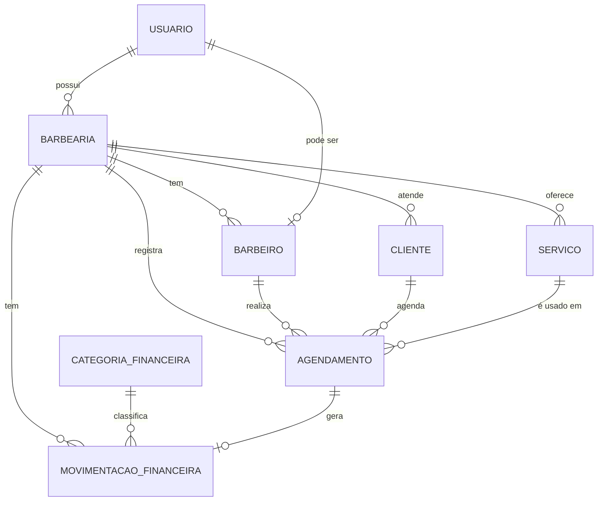

# BarberFlow — Proposta de Produto e Arquitetura

## 1. Visão geral do produto

**Nome provisório:** BarberFlow *(pode mudar depois — o importante agora é o produto, não o nome)*

**Público-alvo:** barbeiros autônomos e pequenas barbearias (1 a 5 profissionais) que hoje controlam agenda e financeiro pelo WhatsApp, caderno ou planilha.

**Problema que resolve:** falta de uma ferramenta simples que unifique agenda de atendimentos e controle financeiro básico, sem a complexidade de sistemas de gestão empresarial genéricos.

**Proposta de valor:** "Agenda e caixa da sua barbearia, num só app, sem complicação." Substitui caderno + WhatsApp + planilha por uma interface única, rápida de usar entre um cliente e outro.

**Funcionalidades essenciais do MVP:** agenda (clientes, serviços, agendamentos com status) + financeiro básico (receitas, despesas, saldo, resumo por período).

**Fica para depois:** múltiplos barbeiros/barbearias, agenda online para o cliente final, notificações, integração com WhatsApp, dashboards avançados, assinaturas pagas, estoque, fidelidade, avaliações, backup em nuvem.

> Importante: mesmo deixando essas funcionalidades para depois, a modelagem do banco de dados abaixo já é desenhada para não exigir reescrita quando elas chegarem. Isso é diferente de *construir* essas funcionalidades agora.

---

## 2. Arquitetura tecnológica recomendada

### Visão geral da comunicação
```
Flutter (app mobile)  <--HTTP/JSON-->  API FastAPI  <--SQL-->  PostgreSQL
```
O Flutter nunca acessa o banco diretamente — tudo passa pela API. Isso separa responsabilidades e permite, no futuro, ter também um painel web sem duplicar lógica de negócio.

### Backend: FastAPI (não Django REST Framework)
Os dois resolveriam o problema, mas para o seu caso o **FastAPI** ganha por três motivos:
- **Curva de aprendizado menor** para quem está começando: menos "mágica" implícita que o Django, você vê explicitamente o que cada rota faz.
- **Documentação automática** (Swagger/OpenAPI) só de declarar os tipos — ótimo para testar a API enquanto o Flutter ainda não existe.
- **Tipagem com Pydantic**, o que reduz bugs bobos de campo faltando ou tipo errado — muito parecido com o rigor que você já tem no T-SQL.

Django REST Framework vale mais a pena quando você precisa de um admin pronto e de muitas convenções "batteries included". Para um MVP enxuto, isso pesa mais do que ajuda.

### Banco de dados: PostgreSQL
Recomendo já começar com PostgreSQL (via Docker local), não SQLite:
- Migrar de SQLite para Postgres depois costuma dar dor de cabeça (tipos, constraints).
- Postgres tem tier gratuito em serviços como Railway/Render/Supabase — importante para quando este projeto "sair do MVP".
- Sua experiência com SQL Server no Crefaz transfere bem: a lógica relacional é a mesma, muda principalmente sintaxe e alguns tipos.

### ORM: SQLModel
Em vez de SQLAlchemy "puro", uso **SQLModel** (criado pelo próprio autor do FastAPI): ele une o modelo do banco e o schema de validação da API na mesma classe, o que significa menos código duplicado para você manter enquanto está aprendendo.

### Autenticação
JWT (JSON Web Token) com fluxo `OAuth2PasswordBearer` do próprio FastAPI + `passlib` (bcrypt) para hash de senha. O token carrega o `usuario_id`; toda rota protegida exige o token no header `Authorization: Bearer <token>`.

### Padrão de arquitetura no backend (camadas simples)
```
Router (recebe request)  →  Service (regra de negócio)  →  Repository (acesso ao banco)  →  Model/DB (SQLModel)
```
A camada de **Repository** é exigida pelo trabalho bimestral da faculdade (orientação a objetos / Clean Code) — ela isola o "como buscar/salvar no banco" do "o que fazer com esses dados" (Service). É uma camada a mais em relação à proposta original, mas simples: cada repository só tem métodos como `criar`, `buscar_por_id`, `listar`, `atualizar`, `deletar` para uma entidade.

### Frontend: Flutter com Riverpod + go_router
Mesma stack que você já está usando no BOB App — Riverpod para estado e go_router para navegação. Isso significa que boa parte do que você já aprendeu ali se aplica direto aqui; a diferença principal é que este app **tem** backend (o BOB é local-first).

Para chamadas HTTP: pacote `dio` (permite interceptors, útil para anexar o token JWT automaticamente em toda requisição).

### Preparando para o futuro sem complicar agora
O ponto-chave: **toda tabela do MVP já carrega `barbearia_id`**, mesmo que hoje só exista uma barbearia por usuário. Isso significa que "múltiplos barbeiros" e "múltiplas barbearias" no futuro são só uma mudança de regra de acesso — não uma migração de banco.

---

## 3. Modelagem inicial das entidades



**Usuario** — id (PK), nome, email (único, obrigatório), senha_hash (obrigatório), tipo (dono/barbeiro), criado_em. Regra: email é o login.

**Barbearia** — id (PK), nome (obrigatório), endereco, telefone, dono_id (FK → Usuario, obrigatório), criado_em. Regra: no MVP, 1 usuário dono = 1 barbearia.

**Barbeiro** — id (PK), usuario_id (FK → Usuario, opcional no MVP — o dono pode ser o próprio barbeiro), barbearia_id (FK, obrigatório), especialidade, ativo (bool). Regra: no MVP, geralmente só um registro (o próprio dono).

**Cliente** — id (PK), barbearia_id (FK, obrigatório), nome (obrigatório), telefone, email (opcional), observacoes, criado_em.

**Servico** — id (PK), barbearia_id (FK, obrigatório), nome (obrigatório), descricao, preco (decimal, obrigatório), duracao_minutos (int), ativo (bool).

**Agendamento** — id (PK), barbearia_id (FK), barbeiro_id (FK, obrigatório), cliente_id (FK, obrigatório), servico_id (FK, obrigatório), data_hora (datetime, obrigatório), status (enum: agendado/confirmado/concluido/cancelado/nao_compareceu), valor (decimal — copiado do serviço no momento do agendamento, para não mudar retroativamente se o preço do serviço mudar depois), observacoes, criado_em. Regra de negócio central: **ao mudar status para "concluído", o sistema gera automaticamente uma MovimentacaoFinanceira de receita** vinculada a esse agendamento.

**CategoriaFinanceira** — id (PK), barbearia_id (FK), nome (ex.: "Corte", "Aluguel", "Produtos"), tipo (receita/despesa).

**MovimentacaoFinanceira** — id (PK), barbearia_id (FK, obrigatório), tipo (receita/despesa, obrigatório), categoria_id (FK, obrigatório), descricao, valor (decimal, obrigatório), data (obrigatório), agendamento_id (FK, opcional — só preenchido quando a movimentação veio de um agendamento concluído), criado_em.

---

## 4. Estrutura dos projetos

### Backend (Python/FastAPI)
```
app/
├── main.py              # cria o app FastAPI, inclui os routers
├── core/
│   ├── config.py        # variáveis de ambiente (DB URL, chave JWT)
│   └── security.py      # hash de senha, criação/validação de token JWT
├── db/
│   └── session.py       # engine e sessão do SQLModel/Postgres
├── models/               # classes SQLModel = tabelas do banco
│   ├── usuario.py
│   ├── barbearia.py
│   ├── cliente.py
│   ├── servico.py
│   ├── agendamento.py
│   └── financeiro.py
├── schemas/              # esquemas de validação/serialização (entrada e saída da API)
├── repositories/          # acesso ao banco — um arquivo por entidade
│   ├── cliente_repository.py
│   ├── servico_repository.py
│   ├── agendamento_repository.py
│   └── financeiro_repository.py
├── services/              # regra de negócio (ex.: gerar receita ao concluir agendamento)
│   ├── agendamento_service.py
│   └── financeiro_service.py
└── api/
    └── routers/           # os endpoints em si, um arquivo por recurso
        ├── auth.py
        ├── clientes.py
        ├── servicos.py
        ├── agendamentos.py
        └── financeiro.py

tests/                       # testes automatizados (pytest)
```

### Frontend (Flutter)
```
lib/
├── main.py               # bootstrap do app
├── core/
│   ├── router/            # go_router
│   ├── theme/
│   └── network/            # cliente dio + interceptor de token
├── features/
│   ├── auth/
│   │   ├── data/           # chamadas à API
│   │   ├── domain/         # modelos
│   │   └── presentation/   # telas + providers Riverpod
│   ├── agenda/
│   ├── clientes/
│   ├── servicos/
│   └── financeiro/
└── shared/                 # widgets reutilizáveis
```
Organização **por feature** (não por tipo de arquivo) — mais fácil de navegar conforme o app cresce, e é o mesmo padrão que você já vem usando no BOB App.

---

## 5. Roadmap de desenvolvimento

| # | Etapa | Objetivo | Resultado esperado |
|---|-------|----------|---------------------|
| 1 | Ambiente | Instalar Flutter SDK, Python + venv, Docker (Postgres) | Ambiente pronto, Postgres rodando em container |
| 2 | Backend inicial | Criar projeto FastAPI, rota de health-check | `GET /health` respondendo 200 |
| 3 | Banco de dados | Configurar SQLModel + conexão com Postgres | Conexão testada, primeira migration |
| 4 | Entidades | Criar os models de todas as tabelas | Tabelas criadas no banco |
| 5 | Autenticação | Registro, login, JWT | Login funcional via Swagger |
| 6 | CRUD Clientes | Endpoints de clientes | CRUD completo testado |
| 7 | CRUD Serviços | Endpoints de serviços | CRUD completo testado |
| 8 | Agendamentos | Criar, listar por período, mudar status | Regra de status funcionando |
| 9 | Financeiro | Receita/despesa, geração automática ao concluir agendamento | Saldo e resumo calculados corretamente |
| 10 | Integração Flutter | Telas consumindo a API real | App conversando com backend |
| 11 | Dashboard | Tela inicial com resumo do dia | Visão geral funcional |
| 12 | Testes | Testes básicos de backend (pytest) | Cobertura dos fluxos principais |
| 13 | Publicação / entrega | Preparar build do app + documentar exemplos de uso da API | App pronto para as lojas / trabalho pronto para entrega |

---

## 6. Primeiro passo prático recomendado

Comece pela **Etapa 1 + Etapa 2**: montar o ambiente e subir um FastAPI mínimo com uma rota `/health`, rodando junto com um Postgres em Docker. É pouco código, mas valida que toda a base (Python, venv, Docker, conexão) está funcionando antes de entrarmos em modelagem de dados de verdade.

Quando estiver pronto, me avise e eu te guio arquivo por arquivo nessa primeira etapa.
